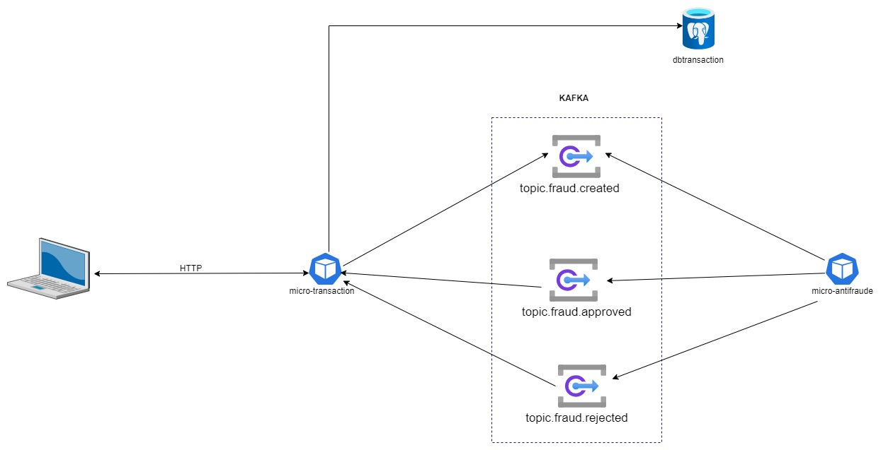
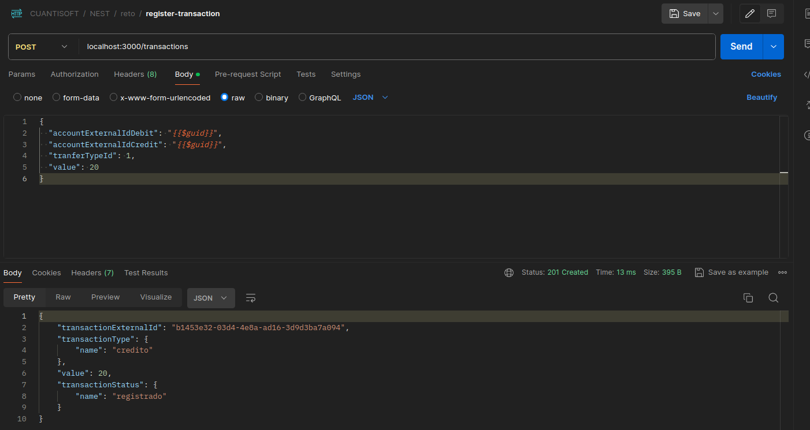
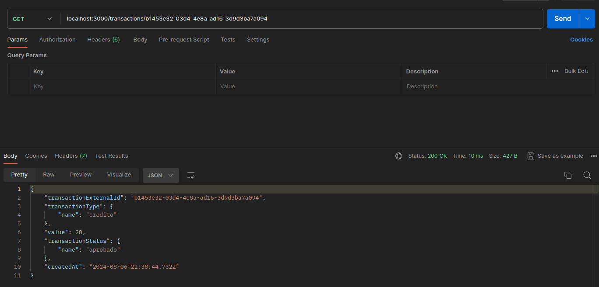
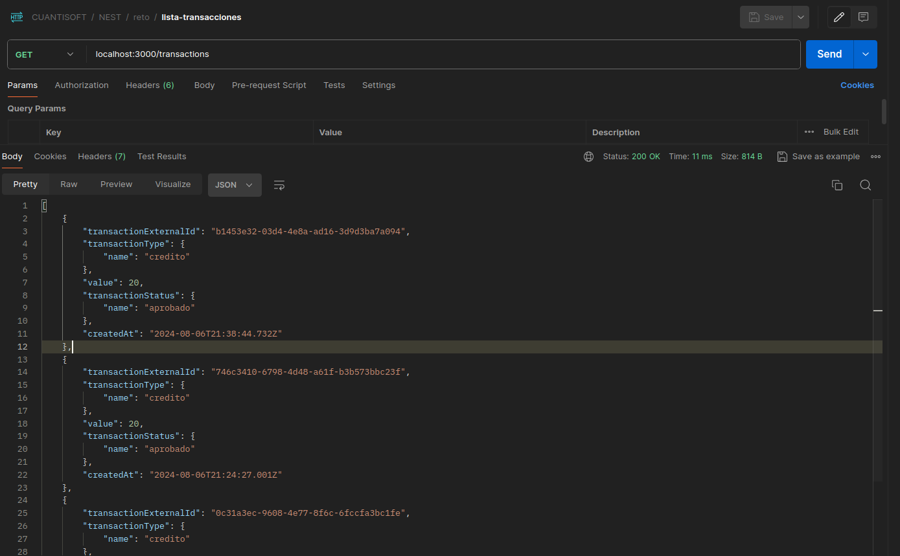

<p align="center">
  <a href="http://nestjs.com/" target="blank"></a>
</p>


# Aplicacion de  Transaciones con arquitectura hexagonal
- nodejs: v 18.20.4
## Estructura del Proyecto Basado en Aplication, Domain, Infrastructure
1) ``Capa Application``
2) ``Capa de Dominio (núcleo-core)``
3) ``Capa de Infraestructura``
- La aplicacipon se subdivide en dos microservicios (micro-intifraude, micro-transaction). Está conformado por nestjs, kafka y postgreSQL
- Cada microservicio tiene un ```application-local.properties```, donde se define lo valores de las variables. La intención de crear este tipo archivo
  es; para la centralización de las variables y configurar en futuras actualizaciones con keyvalues de azure, aws

  


## Instalación y Prueba
### Docker
- ```Requisitos```:
- Se usará las configuraciones de application-prd.properties (no actualizar)
- ```Instalación```:
- Es necesario tener docker en la máquina personal.
- Para iniciar los microservicios (micro-transaction, micro-antifraude) ejecutar el siguiente comando y verificar que los componentes estén en ejecución: ```docker-compose up -d```

### Local (Sin interacción con docker)
- ```Requisitos```: 
1) Tener instalado postgreSQL. Si desean probar con la db del docker-container cambiar los valores en ```application-local.properties```
- ```Instalar localmente```: 
 1) Ingresar a a cada microservicio (micro-intifraude, micro-transaction) y ejecutar: ``npm install``
- ```Probar localmente```: 
 1) Ingresar a a cada microservicio (micro-intifraude, micro-transaction) y ejecutar ``npm run start:dev``

## Prueba
### Ingresar en un navegador, postman. agregar el request:
 - crear una transaccion
 ```bash
 curl --location 'localhost:3000/transactions' \
--header 'Content-Type: application/json' \
--data '{
  "accountExternalIdDebit": "{{$guid}}",
  "accountExternalIdCredit": "{{$guid}}",
  "tranferTypeId": 1,
  "value": 20
}'
```
 - listar transacciones

```bash
curl --location 'localhost:3000/transactions'
```

 - listar una transaccion por id. Reeemplazar el valor de id a buscar
```bash
curl --location 'localhost:3000/transactions/98836e50-c312-4f8b-b6c9-1bba2e5f97a1'
```
## Ejemplo
### Creación de una transacción

### Listar una transacción por id

### Listar transacciones


## Autor
[EVER CARLOS ROJAS](https://github.com/evercarlos)