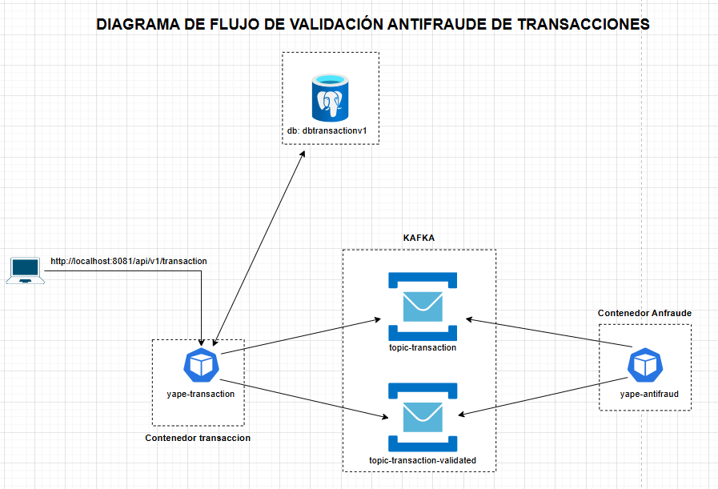

## APLICACIÓN DE TRANSACCIONES: ```YAPE-FINANCIAL```
Aplicación de microservicios para manejo de transacciones financieras con validación antifraude y comunicación asíncrona mediante Kafka.

### ANTIFRAUDE

- Al crear una transacción, se publica un evento en Kafka.
- Un consumidor valida reglas antifraude.
- La transacción puede ser aprobada o rechazada según el monto configurado.

### REQUISITOS

- Docker >= 27.x
- Docker Compose >= 2.x

### COMPONENTES

- JAVA: 21
- SPRING BOOT: 3.2.5
- DOCKER
- KAFKA
- POSTGRESQL

### INSTALACIÓN

- Clonar el repositorio:

```bash
  git clone https://github.com/evercarlos/app-nodejs-codechallenge.git
 ```
 - Entrar a la rama del proyecto:
  ```bash
      git checkout java-codechallenge
  ```
 
- Construir y levantar los contenedores con Docker Compose

   ```bash
    docker-compose up --build -d
  ```

### CONFIGURACIÓN

Las variables de entorno principales se encuentran en el archivo `docker-compose.yml`:
- Base de datos PostgreSQL
- Kafka
- Puertos de exposición

### URL DEL MICROSERVICIO Y DOCUMENTACIÓN SWAGGER
- http://localhost:8081
- Swagger UI: http://localhost:8081/swagger-ui.html

### ARQUITECTURA

La aplicación sigue una arquitectura hexagonal (Ports & Adapters), separando:
- Aplication
- Domain
- Infraestructure (REST, Kafka, persistencia)

La validación antifraude se realiza de forma desacoplada mediante eventos publicados en Kafka.

### ENDPOINTS DISPONIBLES
1. Crea una transacción

 ```bash
curl --location 'http://localhost:8081/api/v1/transaction' \
--header 'Content-Type: application/json' \
--data '{
    "accountExternalIdDebit": "550e8400-e29b-41d4-a716-446655440000",
    "accountExternalIdCredit": "660e8400-e29b-41d4-a716-446655440111",
    "tranferTypeId": 1,
    "value": 10001
  } '
 ``` 

 2. Lista transacción con paginación

 ```bash
curl --location 'http://localhost:8081/api/v1/transaction/withPagination?number=1&size=10' \
--header 'Content-Type: application/json' \
--data ''
 ```
  3. Lista transacción sin paginación

 ```bash
curl --location 'http://localhost:8081/api/v1/transaction' \
--header 'Content-Type: application/json' \
--data ''
 ```

   4. Busca una transaccion por transactionExternalId

 ```bash
curl --location 'http://localhost:8081/api/v1/transaction/{transactionExternalId}' \
--header 'Content-Type: application/json' \
--data ''
 ```
 ### FLUJO DE LA TRANSACCIÓN

#### Creación de una transacción
1. El cliente crea una transacción mediante el endpoint:
   `[POST] /api/v1/transaction`.
2. La transacción se persiste inicialmente con estado `PENDIENTE` en la base de datos PostgreSQL.
3. Se publica un evento de transacción en un tópico de Kafka para su validación antifraude.
4. El microservicio de antifraude consume el evento y valida las reglas de negocio.
5. Como resultado de la validación, la transacción es:
   - `APROBADO` si cumple las reglas.
   - `RECHAZADO` si no cumple las reglas.
6. El estado final de la transacción se actualiza en la base de datos.

#### Consulta de transacciones
- Las transacciones pueden consultarse:
  - Con paginación.
  - Sin paginación.
  - Por `transactionExternalId`.

 ### DIAGRAMA 

